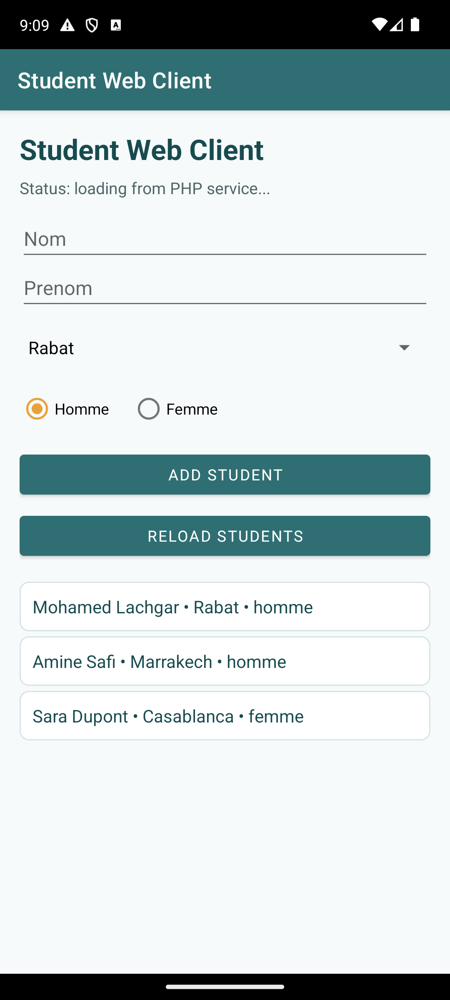
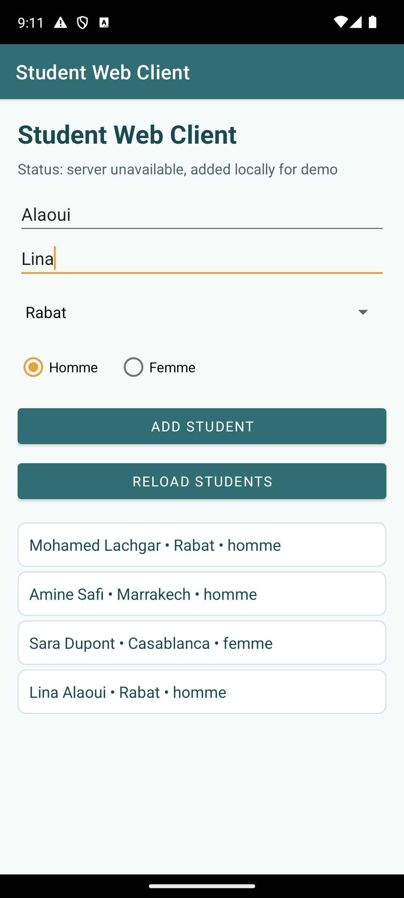

# Student Web Client

Student Web Client is a small Android app for adding and viewing student records through a simple PHP web service flow. The project keeps the lab idea clear while giving the screen a calmer, more polished student-dashboard feel.

## Screenshots





## Overview

The app shows a beginner-friendly form with last name, first name, city, and gender fields. It uses Volley to communicate with PHP endpoints and Gson to parse JSON student data into Java objects.

When the web service is unavailable, the app keeps a small fallback list visible so the interface stays useful during an emulator demo.

## Features

- Student form with name, city, and gender fields
- GET request for loading students from a PHP service
- POST request for creating a new student
- JSON parsing with Gson
- Local fallback data when the server is offline
- Clean list rows for quick reading

## Tech Stack

- Java
- XML layouts
- AndroidX AppCompat
- Material Components theme
- Volley
- Gson

## App Screens

- **Student list**: displays records returned by the service or the fallback sample list.
- **Student form**: collects a new student and sends it as a POST request.

## Project Structure

```text
app/
  src/main/
    java/com/example/lab09/
      MainActivity.java
      beans/Etudiant.java
    res/
      layout/activity_main.xml
      drawable/panel.xml
      xml/network_security_config.xml
docs/
  screenshots/
```

## Implementation

`MainActivity` builds the student flow around Volley requests. It loads students from the PHP endpoint, parses the JSON response with Gson, and renders each `Etudiant` as a simple row in the list. The same activity also sends form values with a POST request and adds the student locally if the backend cannot be reached.

## Build

```powershell
.\gradlew.bat assembleDebug
```
